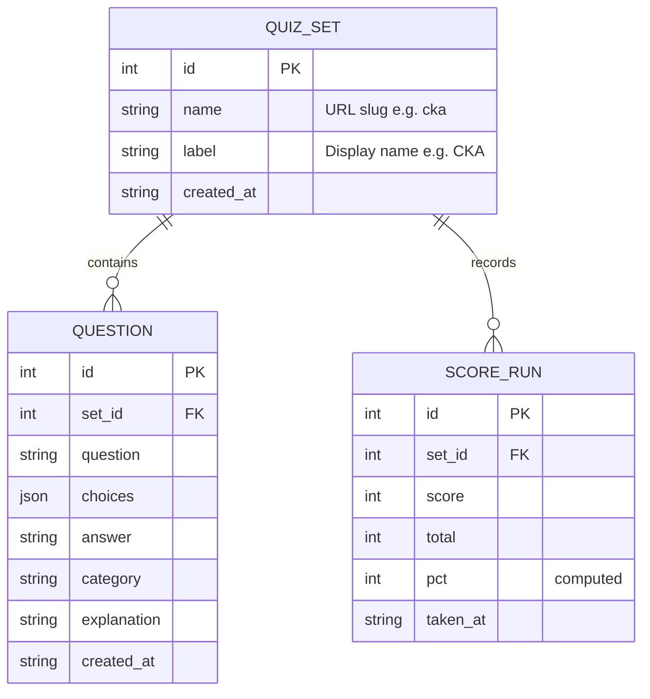
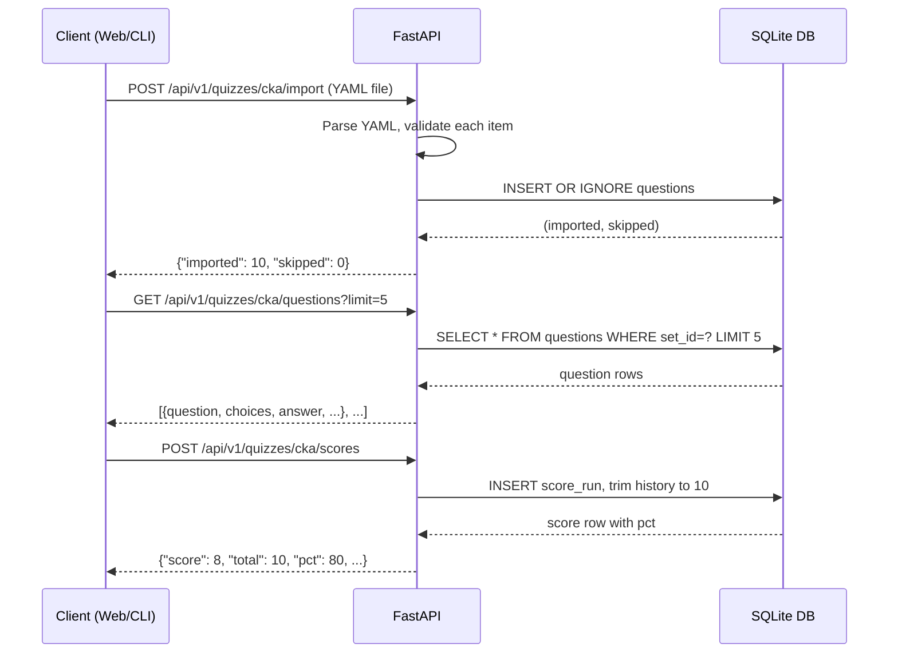

# API Reference

Base path: `/api/v1`

!!! tip "Live interactive docs"
    Open **[Swagger UI](http://localhost:8080/swagger)** or **[ReDoc](http://localhost:8080/redoc)** while the server is running for live try-it-out on every endpoint.
    The raw OpenAPI schema is at `/openapi.json`.

## Resource model



## Endpoints

### Quiz sets

| Method | Path | Description |
|--------|------|-------------|
| `GET` | `/api/v1/quizzes` | List all quiz sets |
| `POST` | `/api/v1/quizzes` | Create a quiz set |
| `DELETE` | `/api/v1/quizzes/{name}` | Delete a set and all its data |
| `POST` | `/api/v1/quizzes/{name}/import` | Import questions from a YAML file |
| `GET` | `/api/v1/quizzes/{name}/export` | Export questions as YAML |

### Questions

| Method | Path | Description |
|--------|------|-------------|
| `GET` | `/api/v1/quizzes/{name}/questions` | List questions (`?category=`, `?limit=`) |
| `POST` | `/api/v1/quizzes/{name}/questions` | Add a single question |
| `PUT` | `/api/v1/quizzes/{name}/questions/{id}` | Update a question (partial) |
| `DELETE` | `/api/v1/quizzes/{name}/questions/{id}` | Delete a single question |
| `DELETE` | `/api/v1/quizzes/{name}/questions` | Delete all questions in a set |

### Scores

| Method | Path | Description |
|--------|------|-------------|
| `GET` | `/api/v1/quizzes/{name}/scores` | List score history (newest first, capped at 10) |
| `POST` | `/api/v1/quizzes/{name}/scores` | Record a completed quiz run |

## Request / response schemas

### QuizSetCreate (POST /quizzes)

```json
{
  "name": "cka",
  "label": "CKA"
}
```

- `name` — URL-safe slug (`^[a-z0-9_-]+$`, min 1 char). Derived automatically from `quiz_name` in the YAML.
- `label` — Display name shown in the picker.

### QuestionCreate (POST /questions)

```json
{
  "question": "Which command shows resource usage per node?",
  "choices": [
    "A. kubectl describe nodes",
    "B. kubectl top nodes",
    "C. kubectl get nodes -o wide",
    "D. kubectl stats nodes"
  ],
  "answer": "B. kubectl top nodes",
  "category": "Workloads",
  "explanation": "kubectl top nodes shows CPU and memory usage."
}
```

- `answer` must match one of the `choices` exactly — validated server-side (returns `422` otherwise).
- `category` and `explanation` are optional.

### ScoreCreate (POST /scores)

```json
{ "score": 8, "total": 10 }
```

- `score` must be `≥ 0`
- `total` must be `> 0`
- `score` must be `≤ total`

### ImportResult (POST /import response)

```json
{ "name": "cka", "imported": 10, "skipped": 2 }
```

- `skipped` counts exact duplicates (same question text in the same set).

## Error responses

All errors use FastAPI's default shape:

```json
{ "detail": "Quiz 'ghost' not found" }
```

| Status | When |
|--------|------|
| `400` | Invalid YAML or missing required fields in import |
| `404` | Quiz set or question not found |
| `409` | Duplicate quiz set name or duplicate question |
| `422` | Validation error (e.g. answer not in choices, invalid score) |

## Request flow


