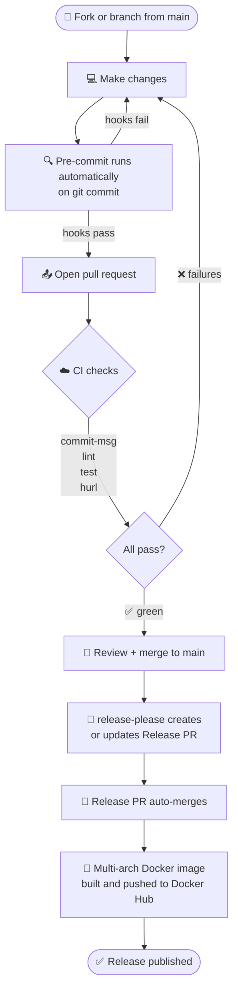

# Contributing

## Setup

```bash
mise run install        # install all pinned dependencies
mise run install-tools  # install hadolint + actionlint (macOS, required for pre-commit)
pre-commit install      # install git hooks
pre-commit install --hook-type commit-msg
```

## Development commands

| Task | Command | What it does |
|------|---------|--------------|
| Local server | `mise run dev` | uvicorn with auto-reload → http://localhost:8080 |
| Unit tests | `mise run test` | pytest for DB and CLI layer |
| API tests | `mise run hurl` | Hurl test suites (server must be running) |
| Lint | `mise run lint` | ruff check + format check |
| Docker | `mise run up` | build + start via docker compose |
| Docs preview | `mise run docs-serve` | MkDocs live preview → http://127.0.0.1:8000 |

## Conventional commits

All commit messages must follow [Conventional Commits](https://www.conventionalcommits.org/).
The `commit-msg` pre-commit hook enforces this automatically.

| Type | When to use |
|------|-------------|
| `feat` | New feature or behaviour |
| `fix` | Bug fix |
| `chore` | Maintenance, dependency updates |
| `docs` | Documentation only |
| `refactor` | Code restructure without behaviour change |
| `test` | Test additions or fixes |
| `ci` | CI/CD pipeline changes |
| `perf` | Performance improvements |
| `build` | Build system changes |
| `revert` | Reverts a previous commit |

**Format:** `type(optional-scope): short description`

```
feat(api): add bulk delete endpoint for questions
fix(web): remove duplicate timer display
docs: add contributing guide
```

## Pull request flow



## Pre-commit hooks

All hooks run automatically on `git commit`. Run manually with:

```bash
pre-commit run --all-files
```

| Hook | Purpose |
|------|---------|
| ruff | Lint and auto-format Python |
| yamllint | YAML style |
| hadolint | Dockerfile best practices |
| actionlint | GitHub Actions workflow lint |
| check-mkdocs | Validate MkDocs config |
| pip-audit | CVE scan on pinned dependencies |
| gitleaks | Secrets detection |
| conventional-pre-commit | Enforce commit message format |

## Branch naming

```
feat/short-description
fix/issue-or-description
chore/what-you-are-doing
docs/page-or-section
```
