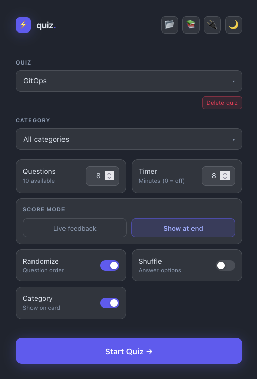

# Quiz Settings

Open the app at `http://localhost:8080`, `http://your_ip:8080`, or `http://your_domain` to reach the settings panel.

---

## ① Quiz

The dropdown lists every question bank currently in the database. Select the one you want to practise.

Use the **📂 Upload YAML** icon (top-right) to add a new question bank — the YAML file defines the quiz name, questions, choices, and answers. See [Question Format](question-format.md) for the file structure.

The **↺** icon (next to the Quiz label) refreshes the question counts for the current quiz without reloading the page. Use this if the counts look stale after a quiz session where you starred or disabled questions.

!!! note "Why counts can look stale"
    When you star (⭐) or disable (⊘) a question during a quiz, the change is saved to the database immediately. However, the counts on the picker screen are only recalculated when the picker loads or when you trigger a bulk action. If you switch back to the picker straight after a quiz and the "X available" number looks wrong, click **↺** to sync it — no page reload needed.

Three bulk actions appear below the dropdown (hidden when not applicable):

| Button | What it does |
|--------|-------------|
| ↩ Re-enable all disabled | Clears the `disabled` flag on every question in this quiz |
| ★ Unstar all | Clears the `important` flag on every question in this quiz |
| Delete quiz | Permanently removes the quiz and all its score history |

---

## ② Category

Filter questions by topic within the selected quiz. Only questions tagged with that category will be included in the session.

| Option | Behaviour |
|--------|-----------|
| All categories | Every question in the quiz is eligible |
| Specific category | Only questions with that tag are included |

---

## ③ Questions

How many questions to ask. The field shows how many are available for the current quiz + category combination and is capped automatically — you cannot ask for more questions than exist.

---

## ④ Timer

Countdown timer for the whole session, in minutes. Appears in the right sidebar during the quiz and shrinks as time runs out — turning red and pulsing when under 20% remains. The session auto-submits when time runs out.

Set to `0` to disable. Defaults to the number of questions selected (one minute per question).

---

## Questions to include

Controls which questions are eligible for the session.

| Option | Questions included |
|--------|--------------------|
| **All** | Every question in the quiz (enabled + disabled + important) |
| **Enabled only** | Only questions not marked as "Never show again" (default) |
| **Disabled only** | Only questions you have hidden — useful for a focused re-review |
| **Important only** | Only questions you have starred (⭐) |

The **Questions** count field updates automatically when you change this filter or the category. The maximum you can request is capped to however many questions match the current filter + category combination.

---

## ⑤ Score mode

Controls when correct/wrong feedback is shown.

| Mode | What happens after you answer |
|------|-------------------------------|
| **Live feedback** | The correct answer turns green ✅, your wrong pick turns red ❌, and the explanation is shown immediately |
| **Show at end** | Your pick is highlighted in neutral (no colour). No right/wrong revealed. All feedback is deferred to the results screen |

Use **Live feedback** to learn as you go. Use **Show at end** to simulate a real exam with no hints mid-session.

---

## ⑥ Randomize — Question order

When **on** (blue), the question order is shuffled at the start of each session. Each session is a different order.

When **off**, questions appear in the same order as the YAML file.

---

## ⑦ Shuffle — Answer options

When **on**, the A/B/C/D answer choices are reshuffled for every question, preventing muscle memory (e.g. "the answer is always B").

When **off**, choices appear in the original order from the YAML file.

---

## ⑧ Category — Show on card

When **on** (blue), the question's category label (e.g. `Networking`, `IAM`) is shown at the top of each question card.

When **off**, category labels are hidden — useful for practising without any topic hints.

---

## Top-right icons

| Icon | Action |
|------|--------|
| 📂 | Upload a YAML question bank |
| 📚 | Open the documentation site |
| 🔌 | Open the Swagger API docs |
| 🌙 / ☀️ | Toggle dark / light mode |

---

## Keyboard shortcuts

During the quiz:

| Key | Action |
|-----|--------|
| `↑` / `↓` | Move highlight between answer choices |
| `A`–`D` or `1`–`4` | Jump directly to that choice |
| `Enter` | Confirm highlighted choice / advance |
| `←` / `→` | Previous / next question |

On the results screen:

| Key | Action |
|-----|--------|
| `↑` / `↓` | Scroll through the question review list |
| `←` / `→` | Cycle between footer buttons |
| `Enter` | Open/close review item or activate button |
