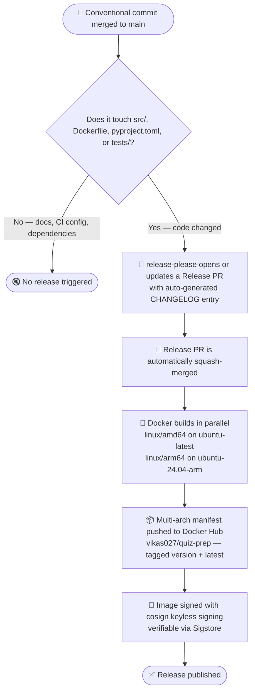

# Releases

Releases are fully automated via [release-please](https://github.com/googleapis/release-please).
No manual tagging or changelog editing needed.

## How it works

## What triggers a release

Only commits that touch files that affect the Docker image trigger the release workflow.
Docs, CI config, test files, and Markdown changes do not.

| Path | Triggers release? | Why |
|------|------------------|-----|
| `src/**` | ✅ Yes | Application code |
| `Dockerfile` | ✅ Yes | Container build instructions |
| `requirements.txt` | ✅ Yes | Production runtime dependencies |
| `requirements-dev.txt` | ✅ Yes | Used inside Docker to build MkDocs site |
| `pyproject.toml` | ✅ Yes | Package metadata and version floors |
| `docs/**` | ❌ No | Documentation only |
| `*.md` | ❌ No | Markdown files |
| `.github/**` | ❌ No | CI/CD config — GH Actions version bumps don't release |
| `tests/**` | ❌ No | Tests are not included in the image |
| `mise.toml` | ❌ No | Local task runner only |

### How dependency updates trigger releases

| Tool | Commit type | Version bump |
|------|------------|-------------|
| Dependabot (pip) | `fix(deps):` | Patch `0.0.X` |
| Dependabot (github-actions) | `chore(deps):` | None — CI config only |
| Renovate (pip packages) | `fix(deps):` | Patch `0.0.X` |
| Renovate (custom: Docker, Tailwind, etc.) | `fix(deps):` | Patch `0.0.X` |
| Renovate (pre-commit hooks) | `chore(ci):` | None — local tooling only |

## Semantic versioning

Versions follow [SemVer](https://semver.org/) — `MAJOR.MINOR.PATCH`.
release-please determines the bump automatically from commit types:

| Commit type | Version bump | Example |
|-------------|-------------|---------|
| `fix:` | Patch `0.0.X` | `fix: handle empty quiz on startup` |
| `feat:` | Minor `0.X.0` | `feat: add category filter to questions API` |
| `feat!:` or `BREAKING CHANGE:` | Major `X.0.0` | `feat!: remove legacy YAML-only import` |
| `chore:`, `docs:`, `ci:` | No bump | — |

## Docker image tags

Each release pushes three tags to `vikas027/quiz-prep`:

| Tag | Example | Use |
|-----|---------|-----|
| Exact version | `1.2.3` | Pin to a specific release |
| Version with v | `v1.2.3` | Conventional `v`-prefix alias |
| Latest | `latest` | Always the newest stable release |

## Changelog

release-please auto-generates `CHANGELOG.md` from commit messages.
Only `feat` and `fix` commits appear in the public changelog.

| Section | Visible | Commit types |
|---------|---------|--------------|
| Features | ✅ | `feat` |
| Bug Fixes | ✅ | `fix` |
| Refactoring | ✅ | `refactor` |
| Performance | Hidden | `perf` |
| Miscellaneous | Hidden | `chore` |
| CI | Hidden | `ci`, `build` |
| Documentation | Hidden | `docs`, `test` |
