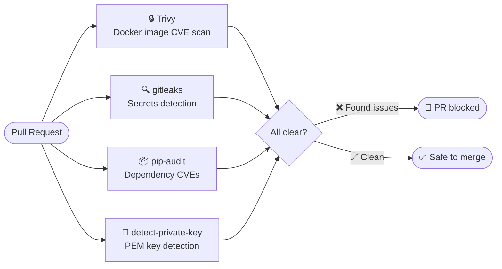

# Security

## Supported versions

Only the latest release receives security fixes.

| Version | Supported |
|---------|-----------|
| Latest (`main`) | ✅ |
| Older releases | ❌ |

## Reporting a vulnerability

**Do not open a public GitHub issue for security vulnerabilities.**

Report privately via [GitHub Security Advisories](https://github.com/vikas027/quiz-prep/security/advisories/new).

- Expected response: within **72 hours**
- Fix timeline: best effort, typically within 7 days for critical issues
- Credit: reporters are acknowledged in the release notes unless anonymity is preferred

## Automated security scanning

Every pull request runs the following checks automatically:

| Tool | What it scans | Severity threshold |
|------|---------------|-------------------|
| [Trivy](https://trivy.dev/) | Docker image CVEs | CRITICAL, HIGH, MEDIUM |
| [gitleaks](https://github.com/gitleaks/gitleaks) | Hardcoded secrets and tokens | All |
| [pip-audit](https://pypi.org/project/pip-audit/) | Python dependency CVEs (OSV database) | All |
| [detect-private-key](https://github.com/pre-commit/pre-commit-hooks) | PEM-formatted private keys | All |

## Container security

The Docker image is built with defence-in-depth:

| Control | Value |
|---------|-------|
| Base image | `python:3.14.6-slim` (minimal attack surface) |
| Runs as | UID 1001 (`quiz` — non-root) |
| Filesystem | `readOnlyRootFilesystem: true` |
| Capabilities | All dropped (`drop: [ALL]`) |
| Privilege escalation | Disabled |
| Image signing | cosign keyless signing on every release |

## Dependency updates

Dependencies are kept current automatically:

- **Renovate** — updates pre-commit hook revisions and Dockerfile tool versions weekly
- **Dependabot** — updates Python packages (pip) and GitHub Actions weekly
